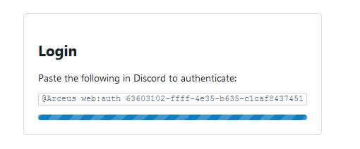
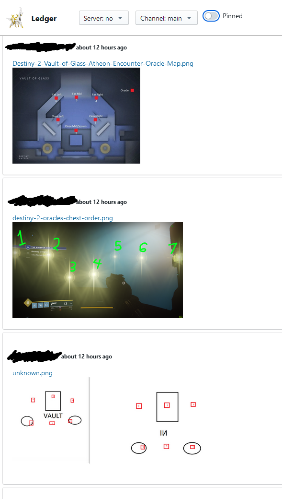

# Arceus Web

This is the web UI for the [Arceus](https://github.com/SamMauldin/arceus) Discord Bot.

It contains functionality for authenticating with Discord, and for viewing
Ledger Discord archives, including stored attachments, and pinned message
history.

## Running

Use `npm run build` or `npm start` to build or start the app.

Set the `SNOWPACK_ARCEUS_ENDPOINT` environment variable to specify the endpoint
to the Arceus GraphQL API.
